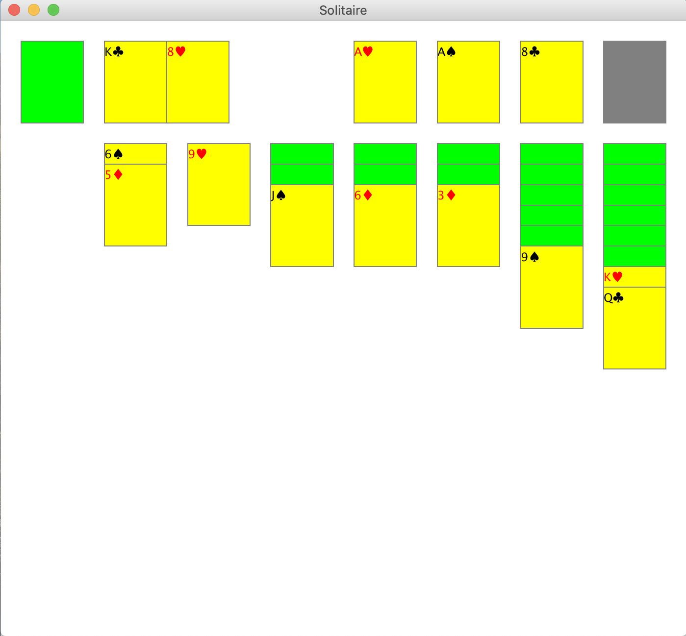

## Solitaire

Drag and drop solitaire.
Written in Java.
Drawn with Javax.Swing / Java.AWT.



#### How to Use:

Compile the game by `cd`ing into the `src` directory and running:

```
mkdir ../out
javac -d ../out *.java;
```

Start the game after compilation by `cd`ing into `../out` directory and running:

```
java Main;
```

(or the Windows equivalent).

#### Change Log:

- Version 1.0 - 4/26/2020
- Version 1.1 - 4/7/2023
  - Updated to `MouseMotionAdapter.onMouseDragged` instead of spinning up a new thread to handle dragged cards.
  - Implemented `ComponentAdapter.componentResized` to recompute size and the spacing of and between elements respectively, instead of recomputing on every paint.
  - Rewrote most of the front and back end, so very likely introduced bugs that I will stumble upon and spend a weekend fixing... three years later?
  - Learned that you cannot move entire stacks of tableau cards because you can only stack opposite color cards on top of one another in Solitaire.
    - When I envisioned the game the first time around, I was really thinking about _Spider Solitaire_.
    - I ended up implementing a way to move entire stacks at once, if I may so brag, but deleted it because I found it that was not actually part of the Solitaire ruleset. Check the commits if you do not believe me. Go on, I will not mind, I promise.
  - I had a blast. And that is what it is all about, is it not? Having fun? 😊
  - Linted the Java files according to the RedHat linter on VSCode.
